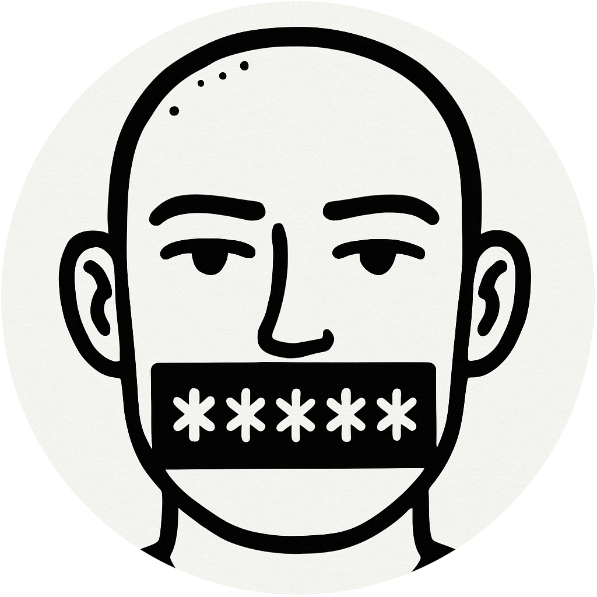

  
  
  <h1 style="margin: 0; font-size: 2.5rem; font-weight: bold; color: #1a1a1a;">
    Coverlay
  </h1>
  
  

    Hide what you don't want to see. 
  

Coverlay is a Firefox extension that lets you draw on top of any page using a canvas overlay in order to hide subtitles or other unwanted elements. 

It supports sticky drawings that stay anchored as you scroll, auto-restore per site, and optional YouTube channel–specific memories.

### Shortcuts
All shortcuts are configurable in Firefox’s “Manage Extension Shortcuts” (about:addons → gear icon).

- Toggle overlay (default Alt+Shift+A): shows/hides the overlay.
- Enable draw mode (unset by default): turns Draw ON (opens overlay if needed).
- Toggle drawings visibility (unset by default): shows/hides drawings without clearing them.
- Toggle UI visibility (unset by default): shows/hides the toolbar UI.

 
<h3>UI (top-right)</h3>

- Draw ON/OFF: enables or disables drawing input (OFF by default).
- Clear: clears the current drawing (also clears the saved site image).
- Color picker: choose brush color (deep purple by default).
- Size slider: choose brush thickness (range 1–64; default is 30% of max).
- Stick ON/OFF: when ON, drawings stick to the page as you scroll (document-anchored); when OFF, drawings are viewport-anchored.
- Hide UI: hides the toolbar while keeping the drawing visible. Reveal it again via the toolbar icon/shortcut.
- ⚙ Settings: opens a dropdown:
  - Remember YouTube channel: store/restore drawings per YT channel (default ON).
  - Run extension without explicit triggering: auto-inject on page loads (default ON).
  - Configure shortcuts: opens Firefox’s native shortcut manager (or shows instructions if blocked).
- ✕ Close: hides the overlay and disables drawing.

 
<h3>Sticky drawings</h3>

- Stick ON draws to a document-sized offscreen canvas and re-renders the visible portion, so drawings stay fixed relative to the page while scrolling/zooming.
- New sites default to Stick ON unless a non-sticky save exists for that site.
- Clear erases both viewport and sticky canvases.

 
<h3>Auto-save/restore</h3>

- Per site (default): drawings are saved automatically after each stroke and restored on load.
- YouTube per channel (optional): if “Remember YouTube channel” is on, drawings are stored/restored per channel on watch pages.
- The overlay loads drawings visually even when Draw is OFF; page clicks pass through until you enable drawing.

 
<h3>Brush settings</h3>

- Per site memory: coverlay remembers brush size and color for each site.
- Inheritance for new sites: if a site has no prior brush settings, it inherits the “last used brush” from any site.
- Defaults: if neither site settings nor last brush exist, size defaults to 30% of the slider range (1–64) and color defaults to deep purple (#6a0dad).
- Live preview: when Draw is ON, the cursor becomes a circular preview sized and colored to the brush. While adjusting the slider, the preview follows the cursor and updates size even if Draw is OFF.

 
<h3>Run behavior</h3>

- Drawing is OFF by default when the overlay opens.
- “Run extension without explicit triggering” (default ON): auto-injects the overlay on page loads so drawings can restore immediately. You can turn this off in Settings.

 
<h3>Permissions</h3>

- storage: store per-site/channel drawings and settings.
- scripting, tabs, &lt;all_urls&gt;: inject content on demand and restore drawings across sites.

 
<h3>Troubleshooting</h3>

- If shortcuts don’t open the manager, open it manually: about:addons → gear icon → Manage Extension Shortcuts.
- If another site element overlaps the UI, the overlay isolates its stacking context to stay on top; reload if a site uses aggressive dynamic layers.

### Privacy

- Coverlay does not collect, transmit, or sell any data. There is no telemetry.
- All drawings and settings are stored locally in your browser via `browser.storage.local`.
- Saved content includes only per-site (and optional per-YouTube-channel) drawings and preferences (e.g., brush, sticky mode, UI position).
- The extension does not make network requests other than those required by Firefox for normal extension updates.

## License 

Apache-2.0

## Thank-yous 

🕊️

